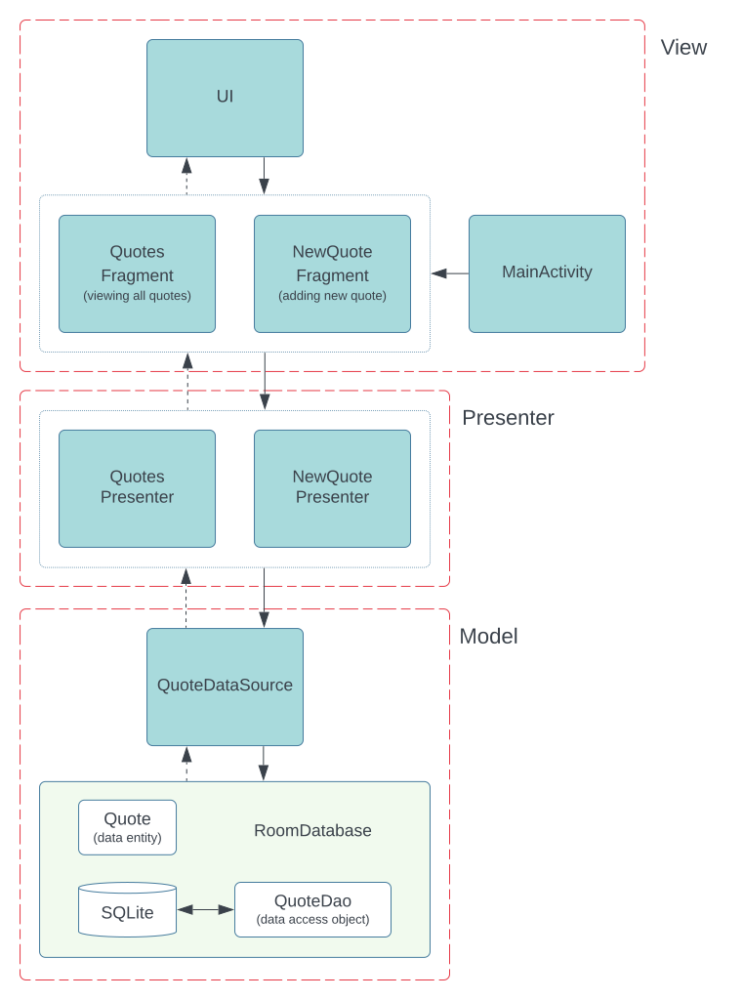

# Model-View-Presenter Pattern

The Model-View-Presenter (MVP) pattern is a software architectural pattern that separates components based on their responsibilities. In MVP, three distinct components are defined:

- **Model**: Handles business logic and data operations.

- **View**: Displays the UI and listens to user actions. This typically corresponds to Activities or Fragments.

- **Presenter**: Mediates between the Model and View, handling presentation logic.

MVP emphasizes the separation of concerns and promotes unit testability. The View informs the Presenter about user actions, which then instructs the Model to update data and the View to refresh the UI.

## Usage

This project consists of two main screens:

1. **QuotesFragment**: Displays all saved quotes from the local database. Users can view and delete any quote.

2. **NewQuoteFragment**: Allows users to add a new quote to the database.

<picture>  
  <source media="(prefers-color-scheme: dark)" srcset="images/mvp-dark.svg">  
  <source media="(prefers-color-scheme: light)" srcset="images/mvp-light.svg">  
    
</picture>

> [!IMPORTANT]
> In projects following the MVC pattern, Activities/Fragments often serve as both the View and Controller, which can lead to architectural challenges. MVP addresses this issue by separating concerns more effectively.

## Technologies Used

- **View Binding**: Simplifies interaction with views, generating a binding class for each XML layout file. This class holds direct references to views with corresponding IDs.

- **Navigation**: Android Jetpack's Navigation component facilitates navigation, from simple button clicks to complex patterns like app bars and navigation drawers.

- **Room**: A persistence library that provides a layer over SQLite, enabling robust database access while leveraging the full capabilities of SQLite.