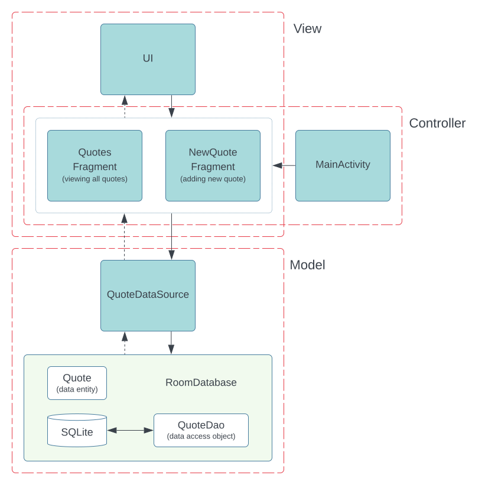

# Model-View-Controller Pattern

The Model-View-Controller (MVC) pattern is a software architectural pattern that separates components based on their responsibilities. In MVC, three distinct components are defined:

- **Model**: This represents the data layer. It includes data objects, database classes, and other business logic responsible for tasks like storing, retrieving, and updating data.

- **View**: The view is responsible for rendering data from the Model in a user-friendly format. It's what the user interacts with and sees on the screen.

- **Controller**: The Controller acts as the central hub, managing the logic of the system. It controls both the Model and the View. Users interact with the system through the Controller.

The key principle is that the Model should not be concerned with how the data is ultimately displayed to the user. Similarly, the View shouldn't be aware of the actual data values it displays, only that it needs to display them. The Controller bridges these components, orchestrating how the data should be presented.

## Usage

This project consists of two main screens:

1. **QuotesFragment**: This screen displays all saved quotes from the local database. Users can view and delete any quote.

2. **NewQuoteFragment**: Users can add a new quote to the database through this screen.

<picture>
  <source media="(prefers-color-scheme: dark)" srcset="images/mvc-dark.svg">
  <source media="(prefers-color-scheme: light)" srcset="images/mvc-light.svg">
  
</picture>

> [!WARNING]
> When applying MVC to Android, the Android Activities/Fragments end up serving as both the View and Controller, which is problematic for separation of concerns and unit testing.

## Technologies Used

- **View Binding**: View binding simplifies interaction with views. Enabling view binding in a module generates a binding class for each XML layout file. This binding class holds direct references to views with corresponding IDs in the layout.

- **Navigation**: Android Jetpack's Navigation component facilitates navigation, from simple button clicks to complex patterns like app bars and navigation drawers.

- **Room**: Room is a persistence library that provides a layer over SQLite, enabling robust database access while leveraging the full capabilities of SQLite.