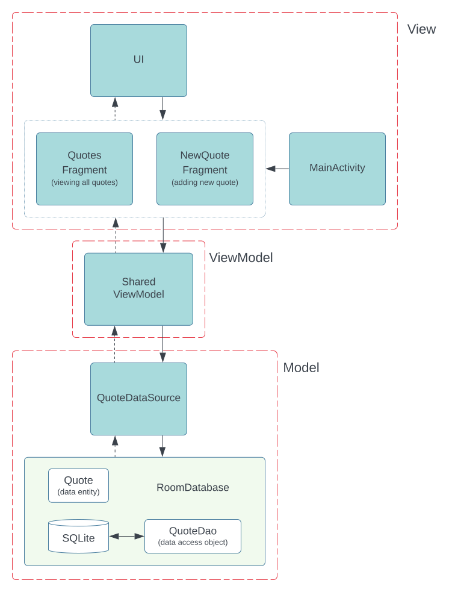

# Model-View-ViewModel Pattern

MVVM, which stands for Model-View-ViewModel, is an architectural pattern designed to achieve a clear separation of concerns by defining distinct roles for each layer:

- **Model**: Retrieves information from the data source and exposes it to the ViewModels.

- **View**: Displays the UI and communicates user actions to the other layers.

- **ViewModel**: Exposes information to the View.

At first glance, MVVM resembles the MVP and MVC architectural patterns. The key distinction lies in MVVM's strong emphasis on the ViewModel not containing any references to Views. The ViewModel only provides information and is not concerned with what consumes it. This promotes a one-to-many relationship, allowing Views to request information from any ViewModel they need.

## Usage

This project consists of two main screens:

1. **QuotesFragment**: Displays all saved quotes from the local database. Users can view and delete any quote.

2. **NewQuoteFragment**: Allows users to add a new quote to the database.

<picture>  
  <source media="(prefers-color-scheme: dark)" srcset="images/mvvm-dark.svg">  
  <source media="(prefers-color-scheme: light)" srcset="images/mvvm-light.svg">  
    
</picture>

> [!IMPORTANT]
> MVVM addresses issues found in other architecture patterns like MVC/MVP, such as fat controllers or a close relationship with the View layer. By introducing ViewModels, designed to be completely separated from the Views, MVVM reduces the risk of having too much code in other layers.

## Technologies Used

- **View Binding**: Simplifies interaction with views by generating a binding class for each XML layout file. This class holds direct references to views with corresponding IDs.

- **Navigation**: Android Jetpack's Navigation component facilitates navigation, from simple button clicks to complex patterns like app bars and navigation drawers.

- **Room**: A persistence library providing a layer over SQLite, enabling robust database access while leveraging the full capabilities of SQLite.